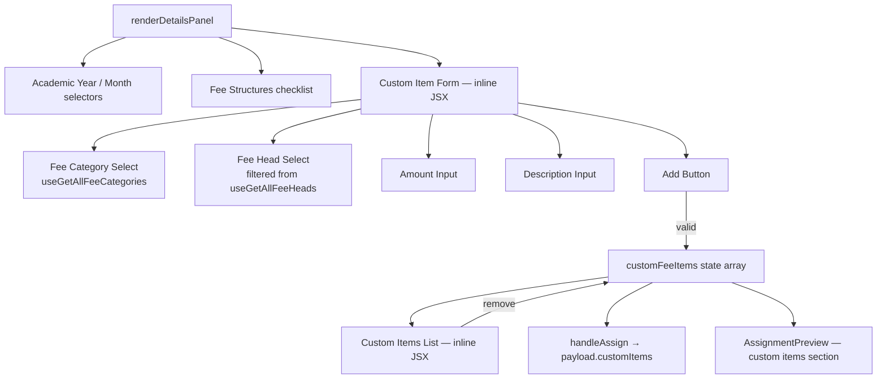

# Design Document: Individual Fee Custom Items

## Overview

This feature extends the **Individual Fee Assignment** wizard (Step 2: "Fee & Period") in `IndividualAssignment.tsx` to support ad-hoc custom fee line items. Users can compose one or more custom items — each with a Fee Category, a filtered Fee Head, a required amount, and an optional description — and stage them in a list before generating the invoice. The custom items are sent alongside the existing `feeStructureIds` in the `GenerateMonthlyInvoicePayload`.

The implementation is entirely client-side within the existing wizard component. No new API endpoints are required; the backend already accepts `customItems` in the invoice payload.

### Key Design Decisions

1. **Inline rendering, not a sub-component** — The Custom Item Form is rendered inline inside `renderDetailsPanel()`, consistent with the existing pattern in `IndividualAssignment.tsx` where all panels are plain JSX functions. Extracting it as a React component would cause input focus loss on every keystroke (React remounts inner components on each render of the parent).

2. **Client-side fee head filtering** — `useGetAllFeeHeads` already fetches all fee heads. Filtering by `feeCategoryId` is done in a `useMemo` inside the component, avoiding an extra network call.

3. **Amount is always required** — Unlike some fee structures where the amount is implicit, every custom item requires an explicit amount regardless of the selected category (including "Others"). This is enforced by the Add button's disabled state and inline validation.

4. **Dual proceed condition** — The "Continue to Discounts" button (and the `tabDone.details` / `tabEnabled.remarks` flags) must be satisfied by *either* at least one fee structure selected *or* at least one custom item staged. Both conditions are valid paths forward.

---

## Architecture

The change is scoped to three files:

```
client/app/dashboard/account/fee-assignment/components/
├── IndividualAssignment.tsx          ← primary change (state + inline form + list)
└── shared/
    └── AssignmentPreview.tsx         ← minor change (show custom items + updated total)
```

No new files, no new API hooks beyond `useGetAllFeeCategories` (already exists in `account-category.api.ts`).



---

## Components and Interfaces

### State Variables (additions to `IndividualAssignment`)

```typescript
// Staged custom items
const [customFeeItems, setCustomFeeItems] = useState<CustomFeeItem[]>([]);

// Custom Item Form fields
const [customCategoryId, setCustomCategoryId] = useState<string>("");
const [customFeeHeadId, setCustomFeeHeadId] = useState<string>("");
const [customAmount, setCustomAmount] = useState<string>("");
const [customDescription, setCustomDescription] = useState<string>("");

// Inline validation errors
const [customAmountError, setCustomAmountError] = useState<string>("");
```

### New Type: `CustomFeeItem`

Defined locally in `IndividualAssignment.tsx` (or in the existing `types/` folder if preferred):

```typescript
interface CustomFeeItem {
  feeHeadId: number;
  feeHeadName: string;      // for display only
  feeCategoryName: string;  // for display only
  amount: number;
  description: string;
}
```

The `feeHeadName` and `feeCategoryName` fields are stored at add-time so the list can render without re-looking up the data. They are stripped before building the invoice payload (only `feeHeadId`, `amount`, `description` are sent).

### Hook Additions

```typescript
// Already imported: useGetAllFeeHeads
// New import needed:
import { useGetAllFeeCategories } from "@/server-action/api/account-category.api";

const { data: feeCategories = [], isLoading: isLoadingCategories } = useGetAllFeeCategories();
```

### Derived State (useMemo)

```typescript
// Fee heads filtered by selected category
const filteredFeeHeads = useMemo(
  () =>
    customCategoryId
      ? feeHeads.filter((h) => h.feeCategoryId === Number(customCategoryId))
      : [],
  [feeHeads, customCategoryId]
);

// Add button disabled condition
const canAddCustomItem =
  !!customFeeHeadId &&
  !!customAmount &&
  Number(customAmount) > 0;

// Updated total including custom items
const customItemsTotal = useMemo(
  () => customFeeItems.reduce((sum, item) => sum + item.amount, 0),
  [customFeeItems]
);

const grandTotal = totalAmount + customItemsTotal;
```

### Updated `tabDone` / `tabEnabled` / `canAssign`

```typescript
const tabDone: Record<string, boolean> = {
  student: !!selectedStudentId,
  // Done when: year + month + (structures OR custom items)
  details: !!(academicYear && month && (selectedStructureIds.length > 0 || customFeeItems.length > 0)),
  discount: false,
  remarks: true,
};

const tabEnabled: Record<string, boolean> = {
  student: true,
  details: !!selectedStudentId,
  discount: !!(selectedStudentId && academicYear),
  // Remarks enabled when: year + month + (structures OR custom items)
  remarks: !!(academicYear && month && (selectedStructureIds.length > 0 || customFeeItems.length > 0)),
};

const canAssign =
  selectedStudentId &&
  academicYear &&
  month &&
  (selectedStructureIds.length > 0 || customFeeItems.length > 0);
```

### Updated `handleAssign`

```typescript
const handleAssign = async () => {
  if (!selectedStudent || !academicYear || !month) return;
  if (selectedStructureIds.length === 0 && customFeeItems.length === 0) return;

  const yearObj = data.academicYears.find((y) => y.name === academicYear);

  const payload: GenerateMonthlyInvoicePayload = {
    academicYearId: yearObj?.id || 0,
    billingMonth: monthMap[month] || 0,
    dueDate: new Date().toISOString(),
    gradeId: selectedStudent.gradeId || 0,
    sectionId: selectedStudent.sectionId || 0,
    studentId: selectedStudent.id,
    feeStructureIds: selectedStructureIds.map((id) => Number(id)),
    isReplace: true,
    customItems: customFeeItems.map(({ feeHeadId, amount, description }) => ({
      feeHeadId,
      amount,
      description,
    })),
  };

  try {
    await generateInvoiceMutation.mutateAsync(payload);
    handleReset();
  } catch {
    // Error handled by mutation onError (Swal)
  }
};
```

### Updated `handleReset`

```typescript
const handleReset = () => {
  setStudentQuery(""); setDebouncedQuery("");
  setTargetGradeId("all"); setTargetSectionId("all");
  setSelectedStudentId(null);
  setAcademicYear(""); setMonth("");
  setSelectedStructureIds([]);
  setRemarks("");
  // Custom item list
  setCustomFeeItems([]);
  // Custom item form fields
  setCustomCategoryId("");
  setCustomFeeHeadId("");
  setCustomAmount("");
  setCustomDescription("");
  setCustomAmountError("");
  setActiveTab("student");
};
```

### `handleAddCustomItem` (inline handler)

```typescript
const handleAddCustomItem = () => {
  // Validate amount
  if (!customAmount) {
    setCustomAmountError("Amount is required");
    return;
  }
  const numAmount = Number(customAmount);
  if (numAmount <= 0) {
    setCustomAmountError("Amount must be greater than 0");
    return;
  }

  const selectedHead = feeHeads.find((h) => h.id === Number(customFeeHeadId));
  const selectedCategory = feeCategories.find((c) => c.id === Number(customCategoryId));

  setCustomFeeItems((prev) => [
    ...prev,
    {
      feeHeadId: Number(customFeeHeadId),
      feeHeadName: selectedHead?.name || "",
      feeCategoryName: selectedCategory?.name || "",
      amount: numAmount,
      description: customDescription.trim(),
    },
  ]);

  // Reset form
  setCustomCategoryId("");
  setCustomFeeHeadId("");
  setCustomAmount("");
  setCustomDescription("");
  setCustomAmountError("");
};
```

### `AssignmentPreview` Changes

The `AssignmentPreview` component receives two new optional props:

```typescript
interface AssignmentPreviewProps {
  // ... existing props ...
  customItems?: { feeHeadName: string; feeCategoryName: string; amount: number }[];
  grandTotal?: number;  // overrides totalAmount when provided
}
```

The preview renders a second section "Custom Items" below "Included Structures" when `customItems` is non-empty, and uses `grandTotal` for the total amount display.

---

## Data Models

### `CustomFeeItem` (local, display-enriched)

| Field            | Type     | Source                          | Sent to API |
|------------------|----------|---------------------------------|-------------|
| `feeHeadId`      | `number` | Selected fee head id            | ✅           |
| `feeHeadName`    | `string` | Looked up at add-time           | ❌ (display) |
| `feeCategoryName`| `string` | Looked up at add-time           | ❌ (display) |
| `amount`         | `number` | User input, validated > 0       | ✅           |
| `description`    | `string` | User input, optional, max 255   | ✅           |

### `CustomFeeItemDto` (API contract, from `invoice.ts`)

```typescript
{
  feeHeadId: number;
  amount: number;
  description: string;
}
```

This matches the existing `GenerateMonthlyInvoicePayload.customItems` type already defined in `client/app/dashboard/types/invoice.ts`.

---

## Correctness Properties

*A property is a characteristic or behavior that should hold true across all valid executions of a system — essentially, a formal statement about what the system should do. Properties serve as the bridge between human-readable specifications and machine-verifiable correctness guarantees.*

### Property 1: Fee head filtering is exact

*For any* list of fee heads and any selected fee category id, the filtered fee heads shown in the dropdown should contain exactly and only the fee heads whose `feeCategoryId` equals the selected category id — no more, no fewer.

**Validates: Requirements 2.2, 2.3**

---

### Property 2: Category change resets fee head selection

*For any* currently selected fee head, selecting a different fee category should result in the fee head selection being cleared (empty string), regardless of what the previous category or fee head was.

**Validates: Requirements 1.4, 2.3**

---

### Property 3: Amount validation rejects non-positive values

*For any* numeric value less than or equal to 0 (including 0, negative numbers, and empty string), the Add button should be disabled and an appropriate validation error should be present; *for any* numeric value strictly greater than 0, the amount is considered valid.

**Validates: Requirements 3.2, 3.3, 3.4**

---

### Property 4: Add button disabled when required fields missing

*For any* combination of form state where `customFeeHeadId` is empty OR `customAmount` is empty or invalid (≤ 0), the Add button should be disabled.

**Validates: Requirements 5.1**

---

### Property 5: Adding an item appends to the list with correct shape

*For any* valid custom item (feeHeadId > 0, amount > 0, description of any string), clicking Add should result in the custom items list growing by exactly one, and the new entry should contain the correct `feeHeadId`, `amount`, and `description` values.

**Validates: Requirements 5.2, 7.3**

---

### Property 6: Successful add resets the form

*For any* valid item addition, after the item is appended to the list, all four form fields (Fee Category, Fee Head, Amount, Description) should be reset to their empty/default states.

**Validates: Requirements 5.3**

---

### Property 7: Custom items list renders required display fields

*For any* item in the custom items list, the rendered row should include the fee head name, the fee category name, the amount formatted as "Rs. X,XXX", and a remove button.

**Validates: Requirements 5.4**

---

### Property 8: Remove eliminates exactly the targeted item

*For any* list of custom items and any item at index `i`, clicking the remove button for item `i` should result in a list that contains all original items except the one at index `i`, preserving order.

**Validates: Requirements 6.1**

---

### Property 9: Invoice payload customItems mirrors the staged list

*For any* list of staged custom items, when `handleAssign` builds the payload, `payload.customItems` should contain exactly the same items (by `feeHeadId`, `amount`, `description`) in the same order, with no extra fields.

**Validates: Requirements 7.1, 7.2, 7.3**

---

### Property 10: Reset clears all custom state

*For any* state of the custom items list and form fields, invoking `handleReset` should result in `customFeeItems` being an empty array and all four form fields (customCategoryId, customFeeHeadId, customAmount, customDescription) being empty strings.

**Validates: Requirements 9.1, 9.2**

---

### Property 11: Proceed condition accepts either structures or custom items

*For any* combination of `selectedStructureIds` and `customFeeItems`, the "Continue to Discounts" button should be enabled if and only if `academicYear` and `month` are set AND (`selectedStructureIds.length > 0` OR `customFeeItems.length > 0`).

**Validates: Requirements 8.1, 8.2, 8.3**

---

## Error Handling

| Scenario | Handling |
|---|---|
| `useGetAllFeeCategories` loading | Fee Category dropdown is `disabled`; no spinner needed (consistent with existing pattern) |
| `useGetAllFeeCategories` returns empty | Dropdown shows placeholder "No categories available"; no selectable options |
| Selected category has no fee heads | Fee Head dropdown shows placeholder "No fee heads available"; no selectable options |
| Amount empty on Add click | Inline error: "Amount is required"; item not added |
| Amount ≤ 0 on Add click | Inline error: "Amount must be greater than 0"; item not added |
| Description > 255 chars | Input `maxLength={255}` attribute prevents entry beyond limit |
| `handleAssign` called with no structures and no custom items | Guard clause returns early; button is already disabled so this is a safety net |
| Invoice generation API error | Handled by existing `generateInvoiceMutation` `onError` (SweetAlert), no change needed |

---

## Testing Strategy

### Unit / Example-Based Tests

Focus on concrete scenarios and edge cases:

- Render the Custom Item Form with `isLoading=true` → Fee Category dropdown is disabled
- Render with empty categories list → placeholder "No categories available"
- Render with no category selected → Fee Head dropdown is disabled
- Select a category with no matching fee heads → placeholder "No fee heads available"
- Click Add with empty amount → "Amount is required" error shown
- Click Add with amount = 0 → "Amount must be greater than 0" error shown
- Click Add with empty description → item added with `description: ""`
- With fee structures selected and no custom items → Continue button enabled
- With custom items and no fee structures → Continue button enabled
- With neither → Continue button disabled
- Remove last item → empty-state message shown

### Property-Based Tests

Use a property-based testing library (e.g., **fast-check** for TypeScript/React) with a minimum of **100 iterations** per property. Each test is tagged with its design property reference.

**Tag format:** `Feature: individual-fee-custom-items, Property {N}: {property_text}`

| Property | Test Description |
|---|---|
| Property 1 | Generate random fee head lists and category ids; assert filtered result equals exact subset |
| Property 2 | Generate random category selections; assert fee head resets to "" on each change |
| Property 3 | Generate random numbers (positive, zero, negative, fractional); assert validation outcome matches sign |
| Property 4 | Generate random form states with missing/invalid fields; assert Add button disabled |
| Property 5 | Generate random valid items; assert list grows by 1 with correct shape |
| Property 6 | Generate random valid items; assert all form fields empty after add |
| Property 7 | Generate random custom item lists; assert each rendered row contains required display fields |
| Property 8 | Generate random lists and random remove indices; assert resulting list is original minus that index |
| Property 9 | Generate random custom item lists; assert payload.customItems matches exactly |
| Property 10 | Generate random form/list states; assert all custom state is empty after reset |
| Property 11 | Generate random (structureIds, customItems, year, month) combinations; assert proceed condition is correct |

### Integration

No new integration tests are required. The existing invoice generation integration test covers the API call. The `customItems` field is already part of the `GenerateMonthlyInvoicePayload` type.
